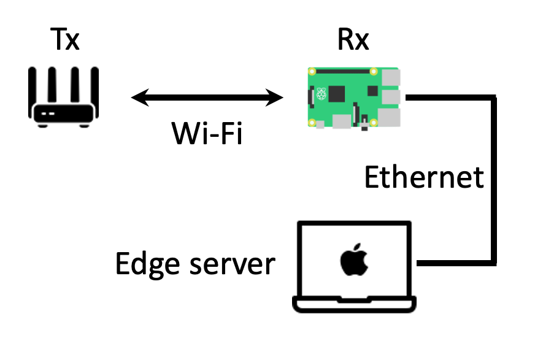

# Gesture Recognition via Wifi CSI

In this project, we aim to design a program that collects CSI from a Wi-Fi router, and recognize seven actions (Circle, Clap, Slide, Kick, Push, Stand up, and Sit) by training a CNN model based on the collected data.

Instead of transmitting special packets continually, we use the Wi-Fi beacon as our Tx signal.

This project is the term project for Wireless Networking - Fundamentals and Applications class in Fall 2021. For more details, please refer to the [project report](WNFA_Final_Project_Report.pdf).

## System
-  Tx: Asus RT-N66U
-  Rx: Raspberry Pi 4B
-  Server: Laptop (Macbook pro)

## System flow
1. Tx broadcasts the Wi-Fi beacons to the Rx.
2. Rx only captures the Wi-Fi beacon packets.
3. When capturing some amounts of the packets, save these packets to a file.
4. Transmit this file to the edge server and get the gesture recognition result.

## References
-  [nexmon-csi](https://github.com/seemoo-lab/nexmon_csi): Channel State Information Extraction on Various Broadcom Wi-Fi Chips
-  [CSIKit](https://github.com/Gi-z/CSIKit): CSI processing tools
